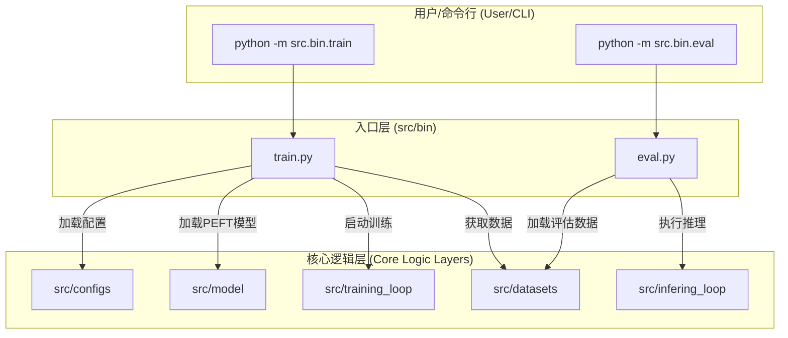

# 模块总结: `src/bin`

## 1. 目录功能定位

`src/bin` 目录是整个项目的**高级功能入口层**。

此目录下的脚本是设计为可直接从命令行执行的顶层应用，分别负责模型的**训练 (Training)** 和**评估 (Evaluation)** 两大核心工作流。它们通过解析命令行参数和配置文件，协调项目下层的各个模块（如配置、模型、数据、训练循环等）来完成复杂的任务。

---

## 2. 模块职责与交互关系

### 文件职责

- **`train.py`**:
  - **职责**: 项目的**主训练脚本**。它负责端到端地完成模型训练的所有步骤，包括：
    1.  加载并校验来自 `.toml` 文件的配置。
    2.  根据配置（如 PEFT、量化）初始化 RWKV 模型和参数。
    3.  设置分布式训练环境（如 DeepSpeed, Triton cache）。
    4.  实例化并启动 PyTorch Lightning `Trainer` 来执行训练循环。
  - **定位**: 训练流程的**总协调器**。

- **`eval.py`**:
  - **职责**: 项目的**主评估脚本**。它负责对一个已经训练好的模型进行详细的性能评估，主要功能包括：
    1.  加载模型和待评估的数据（字节序列）。
    2.  执行推理，计算每个字节的负对数似然（NLL）。
    3.  计算多种高级指标，如频率修正得分、上下文熵修正得分。
    4.  （可选）使用 Matplotlib 生成分数可视化图表，并对齐 UTF-8 字符进行标注。
  - **定位**: 模型性能的**分析与验证工具**。

### 交互关系图 (Mermaid)

---

## 3. 模块依赖方向

- **`train.py`** 依赖于下层模块来完成工作：
  - `src.configs` (用于加载 `file.toml`, `model.toml`, `train.toml`)
  - `src.model.peft.peft_loading` (用于构建支持 PEFT 的模型)
  - `src.training_loop.trainer` (提供核心的 Lightning `train_callback`)
  - `src.datasets.dataset_pt` (提供训练数据加载器)

- **`eval.py`** 依赖于下层模块来完成工作：
  - `src.infering_loop.inferer` (提供 `RWKV_x070` 推理模型)
  - `src.datasets.dataset_pt` (在批量评估模式下提供数据支持)

**总结**: 依赖方向是单向的，即 `src/bin` **调用** `src/configs`, `src/model`, `src/training_loop` 等模块，而**不被它们反向依赖**。

---

## 4. 暴露的公共接口

此目录下的模块主要通过**命令行**调用，但其内部的 `main` 函数可被视为程序化的公共接口。

- **`train.py` -> `main(config_dir: str)`**:
  - **功能**: 启动一次完整的训练会话。
  - **参数**: `config_dir` - 一个包含 `file.toml`, `model.toml`, `train.toml` 配置文件的目录路径。

- **`eval.py` -> `main(args: argparse.Namespace)`**:
  - **功能**: 启动一次完整的评估会话。
  - **参数**: `args` - 一个 `argparse.Namespace` 对象，包含了从命令行解析出的所有评估参数（如 `ctx_len`, `eval_file`, `model_path` 等）。 