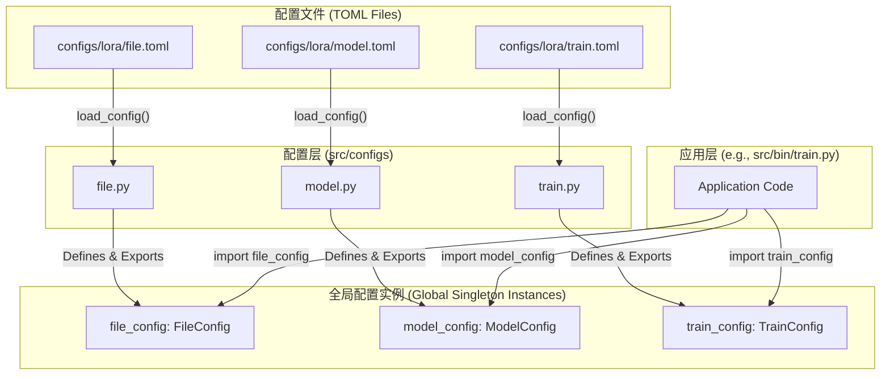

# 模块总结: `src/configs`

## 1. 目录功能定位

`src/configs` 目录是整个项目的**中心化配置管理层**。

它的核心职责是**定义、加载、校验和暴露**项目运行所需的所有超参数。通过将配置逻辑与业务逻辑（如模型构建、训练循环）解耦，该目录实现了高度模块化和可维护性。

该模块采用了**全局单例模式**：每个配置文件（`file.py`, `model.py`, `train.py`）都定义了一个全局可访问的配置对象（`file_config`, `model_config`, `train_config`）。这些对象在程序启动时由相应的 `load_config` 函数从 `.toml` 文件中一次性填充，之后便可在项目的任何地方以只读方式安全地导入和使用。

---

## 2. 模块职责与交互关系

### 文件职责

- **`file.py`**:
  - **职责**: 定义和管理**文件与路径**相关的配置 (`FileConfig`)。这包括：
    - 输入/输出路径（模型权重、数据集、项目产物目录）。
    - PEFT 微调（LoRA, PISSA, DiSHA）相关文件的加载路径。
    - WandB 集成和阶段性训练的状态控制（如自动寻找最新检查点）。
  - **核心方法**: `check()` 方法负责验证所有路径的有效性，并在需要时创建目录。

- **`model.py`**:
  - **职责**: 定义和管理**模型架构**相关的核心超参数 (`ModelConfig`)。这包括：
    - 模型尺寸（层数 `n_layer`、嵌入维度 `n_embd`）。
    - 内部结构尺寸（Attention 维度 `dim_att`、FFN 维度 `dim_ffn`）。
    - 算子与内核选择（如是否启用 `fused_kernel`）。
  - **核心方法**: `check()` 方法能自动推断和补全缺失的配置项（例如，若 `dim_att` 未指定，则默认等于 `n_embd`）。

- **`train.py`**:
  - **职责**: 定义和管理**训练过程**相关的所有超参数 (`TrainConfig`)。这包括：
    - 学习率与优化器参数（`lr_init`, `betas`, `adam_eps`）。
    - 批次大小（`micro_bsz`）与分布式训练策略（`strategy`, `devices`, `num_nodes`）。
    - 训练精度（`precision`）和PEFT方法选择（`peft`）。
  - **核心方法**: `check()` 方法负责执行依赖计算（如 `real_bsz`），设置随机种子，并配置 PyTorch 底层行为（如 `TF32` 开关）。

### 交互关系图 (Mermaid)

---

## 3. 模块依赖方向

- **外部依赖**: Python 标准库 (`dataclasses`, `tomllib`, `os`), `loguru`, `pytorch_lightning`。
- **内部依赖**: 此目录是项目的基础模块之一，**不依赖**于项目中任何其他自定义模块。
- **被依赖关系**: 项目中几乎所有其他模块（`src/bin`, `src/model`, `src/training_loop` 等）都会**直接或间接**地导入并使用本目录暴露的全局配置实例。

---

## 4. 暴露的公共接口

本目录的核心公共接口是三个**全局配置对象**及其**加载函数**：

- **来自 `file.py`**:
  - `file_config: FileConfig`: 全局文件配置实例。
  - `load_config(path: str) -> FileConfig`: 从 TOML 文件加载配置到 `file_config`。

- **来自 `model.py`**:
  - `model_config: ModelConfig`: 全局模型配置实例。
  - `load_config(path: str) -> ModelConfig`: 从 TOML 文件加载配置到 `model_config`。

- **来自 `train.py`**:
  - `train_config: TrainConfig`: 全局训练配置实例。
  - `load_config(path: str) -> TrainConfig`: 从 TOML 文件加载配置到 `train_config`。

此外，每个配置对象还提供两个公共方法：
- `check()`: 用于在加载后校验配置并计算衍生值。
- `show()`: 用于在日志中打印当前配置信息。 