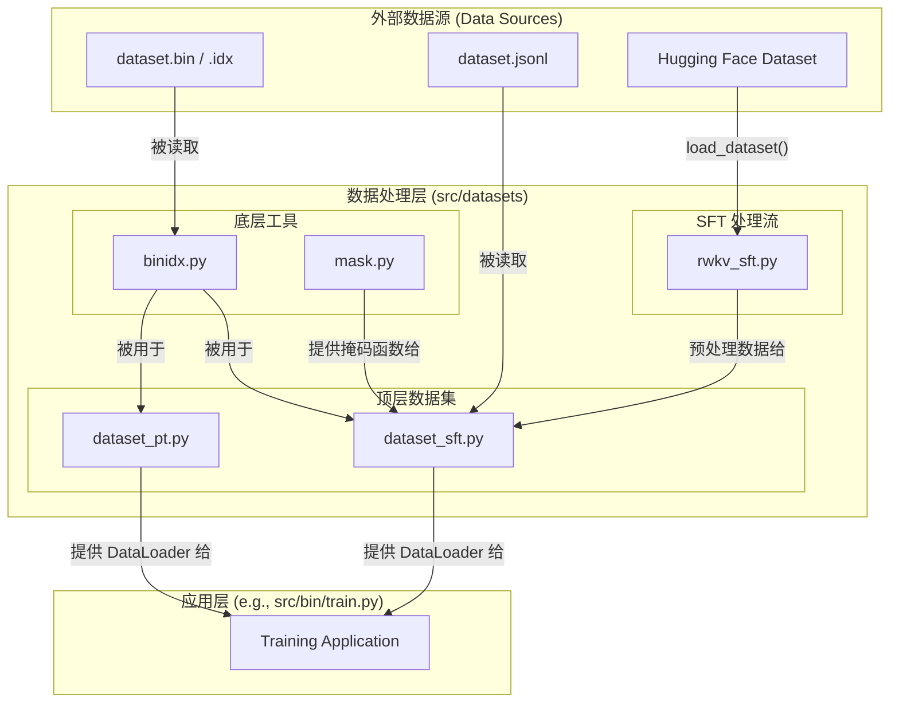

# 模块总结: `src/datasets`

## 1. 目录功能定位

`src/datasets` 目录是整个项目的**数据加载与处理层**。

它的核心职责是处理从磁盘读取原始数据到最终喂给模型的张量（Tensor）之间的所有转换。这包括：
1.  **高效的数据读取**：通过内存映射（mmap）技术支持 TB 级二进制语料的快速随机访问。
2.  **多范式数据支持**：同时支持大规模**预训练（Pre-Training）**和**指令监督微调（Supervised Fine-Tuning, SFT）**两种训练范式。
3.  **多格式兼容**：能够处理多种数据源，包括自定义的 `.bin`/`.idx` 二进制格式、标准的 `.jsonl` 文件，以及来自 Hugging Face Hub 的数据集。
4.  **数据转换与增强**：执行必要的数据转换，如分词（Tokenization）、填充（Padding）以及在 SFT 场景下至关重要的**损失掩码（Loss Masking）**生成。

---

## 2. 模块职责与交互关系

### 文件职责

- **`binidx.py`**:
  - **职责**: **核心数据存取引擎**。实现了 `MMapIndexedDataset` 类，它使用 `numpy.memmap` 来零拷贝地读取 `.bin`（数据）和 `.idx`（索引）文件对。这是处理大规模语料库的性能基石，实现了秒级加载和高效的随机访问。
  - **定位**: 底层数据格式的读取器。

- **`dataset_pt.py`**:
  - **职责**: **预训练（Pre-Training）数据加载器**。它基于 `MMapIndexedDataset` 实现了一个 PyTorch `Dataset` 和 `LightningDataModule`。其特色是采用"magic prime"和一个黄金分割比率的算法来生成样本索引，确保在多轮（epoch）和多设备（DDP）训练中，数据既能被充分遍历，又能保持良好的随机性。
  - **定位**: 预训练任务的数据供给模块。

- **`dataset_sft.py`**:
  - **职责**: **监督微调（SFT）数据加载器**。这是一个功能灵活的 `Dataset` 和 `LightningDataModule`，作为 SFT 数据的分发中心。它可以处理三种数据类型：
    1.  `sft`：由 `rwkv_sft.py` 预处理好的数据。
    2.  `jsonl`：直接读取标准的 JSON Lines 文件。
    3.  `binidx`：复用 `binidx` 格式进行微调。
    它还负责调用 `mask.py` 中的函数来应用损失掩码。
  - **定位**: SFT 任务的统一数据供给模块。

- **`rwkv_sft.py`**:
  - **职责**: **SFT 数据预处理器**。这是一个高级工具，专门用于处理原始的 SFT 数据。它使用 Hugging Face `datasets` 库从源（如本地文件或 Hub）加载数据，应用指令模板（如 `### Instruction:`），进行分词，并最关键地，生成带有 `IGNORE_INDEX` 的标签，以确保损失只在模型需要学习的部分（即"回答"）上计算。
  - **定位**: 原始 SFT 数据到训练样本的转换器。

- **`mask.py`**:
  - **职责**: **损失掩码生成工具**。提供了一系列函数，用于根据序列中的特殊标记（如 "User:" 和 "Assistant:"）生成 0/1 掩码。这使得训练过程可以精确控制哪些 Token 对损失函数有贡献，是 SFT 的核心技术之一。
  - **定位**: SFT 训练中的一个关键辅助工具。

### 交互关系图 (Mermaid)

---

## 3. 模块依赖方向

- **`binidx.py` 和 `mask.py`** 是基础工具，不依赖于本目录内其他模块。
- **`rwkv_sft.py`** 依赖 Hugging Face `datasets` 和 `transformers` 库。
- **`dataset_sft.py`** 依赖 `binidx.py`, `mask.py`, 和 `rwkv_sft.py` 来处理不同数据源。
- **`dataset_pt.py`** 依赖 `binidx.py`。
- 整个目录被上层模块（如 `src/bin`）所依赖。

---

## 4. 暴露的公共接口

此目录主要通过 `LightningDataModule` 对外提供服务。

- **`dataset_pt.py`**:
  - `MyDataModule`: 用于预训练的 Lightning DataModule。
  - `get_data_by_l_version(trainer)`: 获取该 DataModule 实例的工厂函数。

- **`dataset_sft.py`**:
  - `MyDataModule`: 用于 SFT 的 Lightning DataModule。
  - `get_data_by_l_version(trainer)`: 获取该 DataModule 实例的工厂函数。
  - `get_vocab_size()`: 一个在模型初始化前推断词表大小的工具函数。

- **`binidx.py`**:
  - `MMapIndexedDataset`: 核心的二进制数据读取类，也可被外部独立使用。

- **`rwkv_sft.py`**:
  - `sft_dataset(script_args)`: 处理原始 SFT 数据集的高级函数。

- **`mask.py`**:
  - `mask_fn_dict`: 包含不同掩码生成策略的函数字典。 