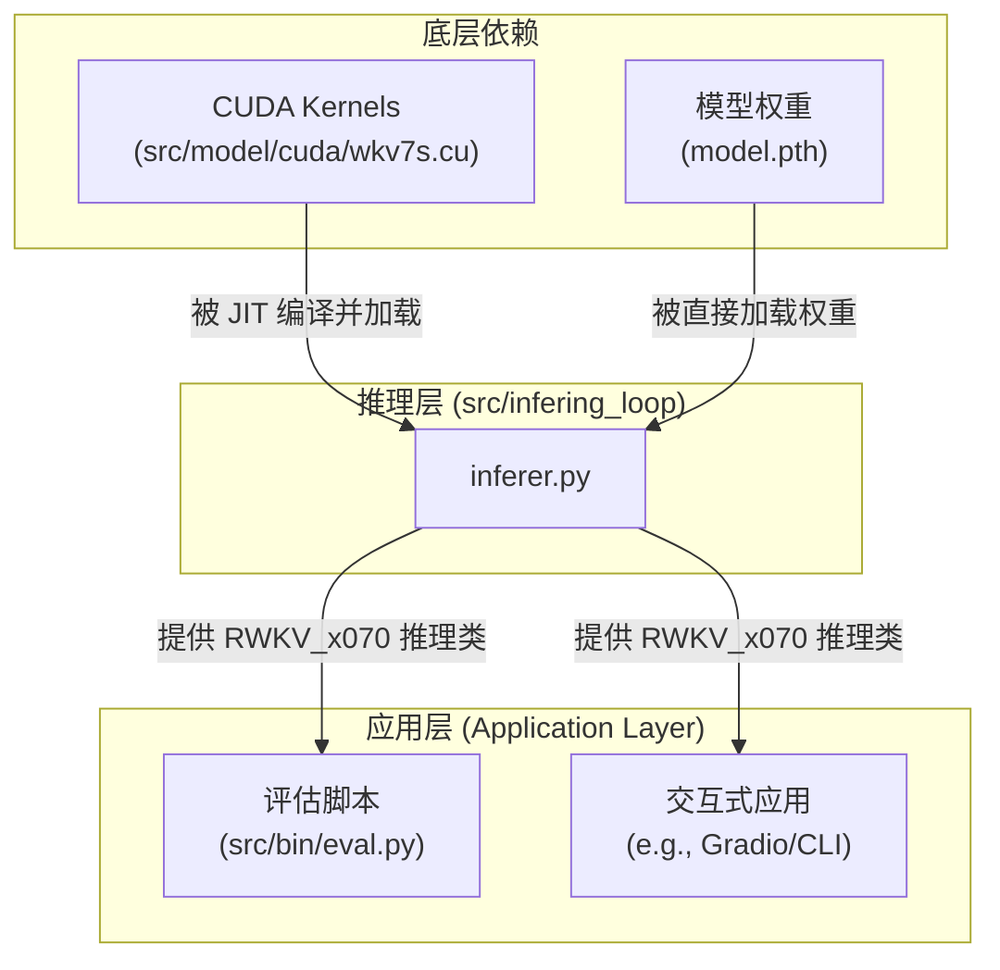

# 模块总结: `src/infering_loop`

## 1. 目录功能定位

`src/infering_loop` 目录是项目的**纯推理执行层 (Inference-Only Execution Layer)**。

它的核心目标是提供一个与训练框架（如 PyTorch Lightning）完全解耦的、轻量级且高性能的推理引擎。此模块专为模型部署、评估或交互式应用而设计，其所有组件都围绕**速度和低资源占用**进行了优化。

该目录下的实现不包含任何梯度计算或优化器逻辑，而是直接加载预训练好的 `.pth` 权重文件，并利用即时编译（JIT）的自定义 CUDA 内核来执行核心运算。

---

## 2. 模块职责与交互关系

### 文件职责

- **`inferer.py`**:
  - **职责**: 此单个文件封装了推理所需的全部逻辑，是一个自包含的推理引擎。其关键组件包括：
    1.  **CUDA 内核加载与编译**: 在运行时通过 `torch.utils.cpp_extension.load` 动态编译并加载位于 `src/model/cuda/` 下的 `wkv7s.cu` 自定义 CUDA 内核。这是实现高性能 WKV 注意力计算的关键。
    2.  **`WKV_7(torch.autograd.Function)`**: 一个自定义的 Autograd 函数，它作为 Python 代码与编译好的 CUDA 内核之间的桥梁。它只实现了 `forward` 方法，不包含 `backward`，明确了其仅用于前向推理的目的。
    3.  **`RWKV_x070(torch.jit.ScriptModule)`**: 一个轻量级的、专为推理设计的 RWKV-7 模型实现。它的特点是：
        - 直接从 `.pth` 文件加载权重，并进行推理友好的布局转换。
        - 实现了 `forward_one`（单步/RNN模式）和 `forward_seq`（序列/并行模式）两种方法，以高效支持自回归生成和批量评估。
        - 显式管理和传递循环状态（`state`），这是 RWKV 作为 RNN 高效推理的基础。
  - **定位**: 项目的**核心推理引擎**。

### 交互关系图 (Mermaid)

---

## 3. 模块依赖方向

- **外部依赖**: `torch`, `numpy`。
- **内部依赖**:
  - 它依赖于 `src/model/cuda/` 目录下的 CUDA 内核**源代码文件**进行即时编译。
  - 它不依赖于项目中的任何其他 Python 模块，保持了高度的独立性。
- **被依赖关系**:
  - 主要被需要执行模型推理的上层应用所依赖，最典型的例子是 `src/bin/eval.py`。

---

## 4. 暴露的公共接口

此目录最核心的公共接口是 `RWKV_x070` 类。

- **`RWKV_x070(args)`**:
  - **功能**: 构造函数。接收一个包含模型配置（如 `n_layer`, `n_embd`）和模型权重路径（`MODEL_NAME`）的参数对象，并返回一个初始化完成、随时可用的推理模型实例。
  - **接口**: `__init__(self, args)`

- **`RWKV_x070.forward(idx, state, full_output=False)`**:
  - **功能**: 模型的主推理方法。它接收输入的 Token 索引（单个或序列）和上一时刻的循环状态 `state`，然后返回当前步的 logits 和更新后的 `state`。这种显式的状态传递是其高效自回归能力的关键。
  - **接口**: `forward(self, idx, state, full_output=False)` 