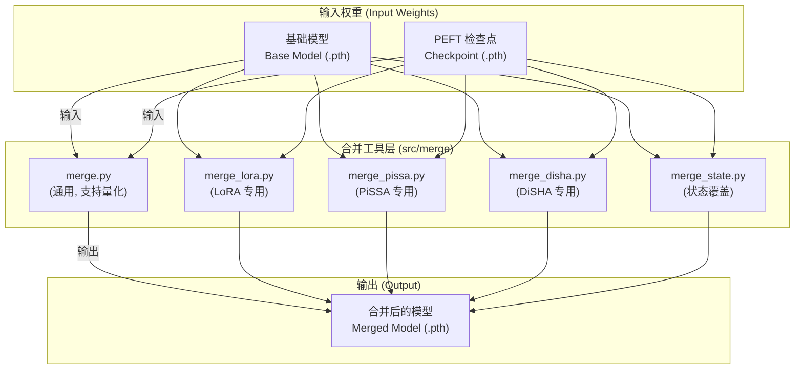

# 模块总结: `src/merge`

## 1. 目录功能定位

`src/merge` 目录是项目的**PEFT 权重合并与导出层**。

此目录下的脚本均为独立的命令行工具，其核心且唯一的功能是：将通过参数高效微调（PEFT）方法（如 LoRA, PiSSA, DiSHA）学到的"增量"权重，与原始的基础模型权重进行数学合并。

最终产出物是一个标准的、单一的 `.pth` 权重文件。这个文件包含了基础模型和微调知识，可以直接被推理引擎（如 `src/infering_loop`）加载使用，无需任何额外的 PEFT 依赖或代码。因此，该目录扮演着将微调后的模型**"固化"**以便于部署和分发的角色。

---

## 2. 模块职责与交互关系

### 文件职责

- **`merge.py`**:
  - **职责**: **主要的、功能最丰富的合并脚本**。它支持 LoRA 和 PiSSA 两种方法，并且提供了对合并后权重进行**量化**的选项（使用 `bitsandbytes` 支持 `4bit`, `nf4` 等格式）。使用 `argparse` 进行参数解析，是功能最全面的合并工具。
  - **定位**: 通用型、支持量化的合并工具。

- **`merge_lora.py`**:
  - **职责**: **独立的 LoRA 合并脚本**。它只处理标准的 LoRA 合并逻辑（`W_new = W_base + B @ A * scale`）。使用简单的 `sys.argv` 进行参数解析，不包含量化功能。
  - **定位**: 简化的、专用于 LoRA 的快速合并工具。

- **`merge_pissa.py`**:
  - **职责**: **独立的 PiSSA 合并脚本**。它实现了 PiSSA 的差分合并逻辑（`W_new = (W_base - B_init @ A_init) + B @ A`）。与 `merge_lora.py` 类似，它也使用 `sys.argv` 且不支持量化。
  - **定位**: 简化的、专用于 PiSSA 的快速合并工具。

- **`merge_disha.py`**:
  - **职责**: **独立的 DiSHA 合并脚本**。它处理 DiSHA 复杂的分块矩阵运算合并逻辑，依赖 `einops` 库进行张量重排。支持量化。
  - **定位**: 专用于 DiSHA 方法的、支持量化的合并工具。

- **`merge_state.py`**:
  - **职责**: **状态覆盖工具**。与其他脚本不同，它不执行数学合并。而是直接用"状态微调（State Tuning）"检查点中的权重**覆盖**基础模型中同名的权重。这适用于仅微调了模型中某些特定完整张量（如 Embedding 或 LayerNorm）的场景。
  - **定位**: 用于"状态微调"等直接替换权重的合并工具。

### 交互关系图 (Mermaid)

*（注：每个脚本都是独立的，此处将它们并列以展示目录的整体功能。）*

---

## 3. 模块依赖方向

- **外部依赖**: `torch`, `bitsandbytes` (在 `merge.py` 和 `merge_disha.py` 中), `einops` (在 `merge_disha.py` 中)。
- **内部依赖**: 此目录中的所有脚本都是自包含的，不依赖于项目中的任何其他 Python 模块。
- **被依赖关系**: 这些脚本是终端工具，**不被**任何其他模块导入或依赖。

---

## 4. 暴露的公共接口

此目录下的所有文件都是**命令行工具**，它们的公共接口即是各自的**命令行参数**。

- **`merge.py`**: 基于 `argparse`，参数如 `--type`, `--base_model`, `--lora_checkpoint`, `--output`, `--quant`。
- **`merge_lora.py`**: 基于 `sys.argv`，参数如 `<lora_alpha>`, `<base_model.pth>`, `<lora_checkpoint.pth>`。
- **`merge_pissa.py`**: 基于 `sys.argv`，参数如 `<base_model.pth>`, `<lora_init.pth>`, `<lora_checkpoint.pth>`。
- **`merge_disha.py`**: 基于 `argparse`，参数如 `--base_model`, `--peft_checkpoint`, `--output`, `--quant`。
- **`merge_state.py`**: 基于 `argparse`，参数如 `--base_model`, `--state_checkpoint`, `--output`。 