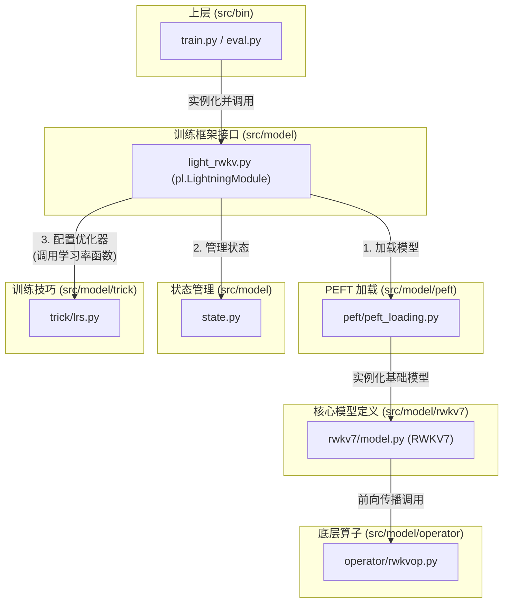

# 模块总结: `src/model`

## 1. 目录功能定位

`src/model` 目录是整个项目的**心脏**，承担了从底层计算、核心模型定义、PEFT策略实现到与训练框架集成的全部核心职责。它是一个高度结构化的模块集合，定义了"模型是什么"以及"模型如何训练"。

该目录的整体设计体现了清晰的**分层思想**和**关注点分离**原则：
- **`rwkv7`** 负责定义纯粹的、静态的 RWKV 模型计算图。
- **`operator`** 和 **`cuda`** 负责将计算图中的抽象算子（WKV）映射到高性能的硬件加速实现。
- **`peft`** 负责在不修改基础模型的情况下，动态地为其"装配"上参数高效微调的能力。
- **`trick`** 提供可复用的、与模型无关的训练优化策略。
- **`light_rwkv.py`** 和 **`state.py`** 则作为顶层粘合剂，将上述所有组件与 PyTorch Lightning 训练框架连接起来，并管理复杂的训练状态。

最终，该目录向上层（`src/bin`）提供了一个统一的、配置驱动的接口，用以获取一个准备就绪、可直接投入训练或推理的模型实例。

---

## 2. 模块职责与交互关系

### 顶层文件职责

- **`light_rwkv.py`**:
  - **职责**: **PyTorch Lightning 训练接口层**。作为 `pl.LightningModule` 的子类，它是模型与训练框架的桥梁。
  - **核心功能**:
    1.  在 `__init__` 中调用 `peft_loading.load_model_and_apply_peft`，获取一个已应用 PEFT 策略的基础模型。
    2.  实现 `training_step` 和 `forward` 方法，定义了单步训练的损失计算逻辑，并能根据 `config.train.train_type` (如 `infctx`) 动态切换计算模式。
    3.  实现 `configure_optimizers` 方法，负责创建优化器（如 AdamW），并可选择性地应用分层学习率（Layerwise Learning Rate Decay）。
  - **定位**: 训练流程控制器。

- **`state.py`**:
  - **职责**: **模型循环状态（RNN State）管理层**。
  - **核心功能**: 定义了 `BlockState` 和 `BlockStateList` 两个核心数据类。`BlockStateList` 作为一个可迭代、可索引的容器，被专门设计用来高效地存储、传递和切片 RWKV 模型在序列处理中每一层的 RNN 状态。这对于 `infctx` 等需要精确状态管理的训练模式至关重要。
  - **定位**: `infctx` 模式的核心数据结构支撑。

### 子目录职责

- **`rwkv7/`**:
  - **职责**: **核心模型架构定义层**。自底向上构建了纯净的 `RWKV7` 模型。详见 `src/model/rwkv7/MODULE_SUMMARY.md`。

- **`peft/`**:
  - **职责**: **参数高效微调（PEFT）实现层**。负责加载基础模型并向其注入 LoRA/PiSSA 等模块。详见 `src/model/peft/MODULE_SUMMARY.md`。

- **`operator/`**:
  - **职责**: **底层计算算子调度层**。提供一个统一接口，根据配置动态选择 CUDA, Triton, FLA 等后端来执行 WKV 运算。详见 `src/model/operator/MODULE_SUMMARY.md`。

- **`trick/`**:
  - **职责**: **独立训练技巧实现层**。提供如学习率调度等与框架解耦的工具函数。详见 `src/model/trick/MODULE_SUMMARY.md`。

- **`cuda/`**:
  - **职责**: **存放自定义 CUDA C++/CUDA 源代码**。这些是 `.cu` 和 `.cpp` 文件，被 `operator/cuda.py` 在运行时进行即时编译（JIT），为 WKV 运算提供最高性能的默认后端。

### 交互关系图 (Mermaid)

*关系说明：整个流程由上至下发起。`bin` 模块创建 `light_rwkv` 实例。`light_rwkv` 在初始化时，通过 `peft` 模块加载并配置 `rwkv7` 模型。在训练过程中，`rwkv7` 模型的计算会通过 `operator` 调度到具体后端。同时，`light_rwkv` 会利用 `state` 模块管理 RNN 状态，并利用 `trick` 模块的函数来调整学习率。*

---

## 3. 模块依赖方向

这是一个典型的分层架构：
- **顶层**: `light_rwkv.py` 是最高层的封装，它依赖于 `peft`、`state` 和 `trick`。
- **中间层**: `peft_loading.py` 依赖于 `rwkv7` 来获取基础模型。`rwkv7` 的 `att.py` 依赖于 `operator` 来执行计算。
- **底层**: `operator` 根据配置选择依赖 `cuda.py`, `triton.py` 或 `fla.py`。`cuda.py` 进一步依赖 `src/model/cuda` 下的源文件。`trick` 和 `state` 是相对独立的底层工具/数据结构。

---

## 4. 暴露的公共接口

- **`light_rwkv.py`**:
  - `RWKV_x060_Lightning(config: All_Config) -> pl.LightningModule`:
    - **功能**: 整个 `model` 模块最核心的对外接口。返回一个完整的、配置好的、可直接被 PyTorch Lightning `Trainer` 使用的模型实例。

- **`state.py`**:
  - `BlockState`, `BlockStateList`:
    - **功能**: 对外提供的高效状态管理数据结构。

- **`peft_loading.py`**:
  - `load_model_and_apply_peft(...)`:
    - **功能**: 虽然主要被 `light_rwkv` 内部调用，但也可以单独使用，以获取一个应用了 PEFT 的基础 `nn.Module` 模型。 