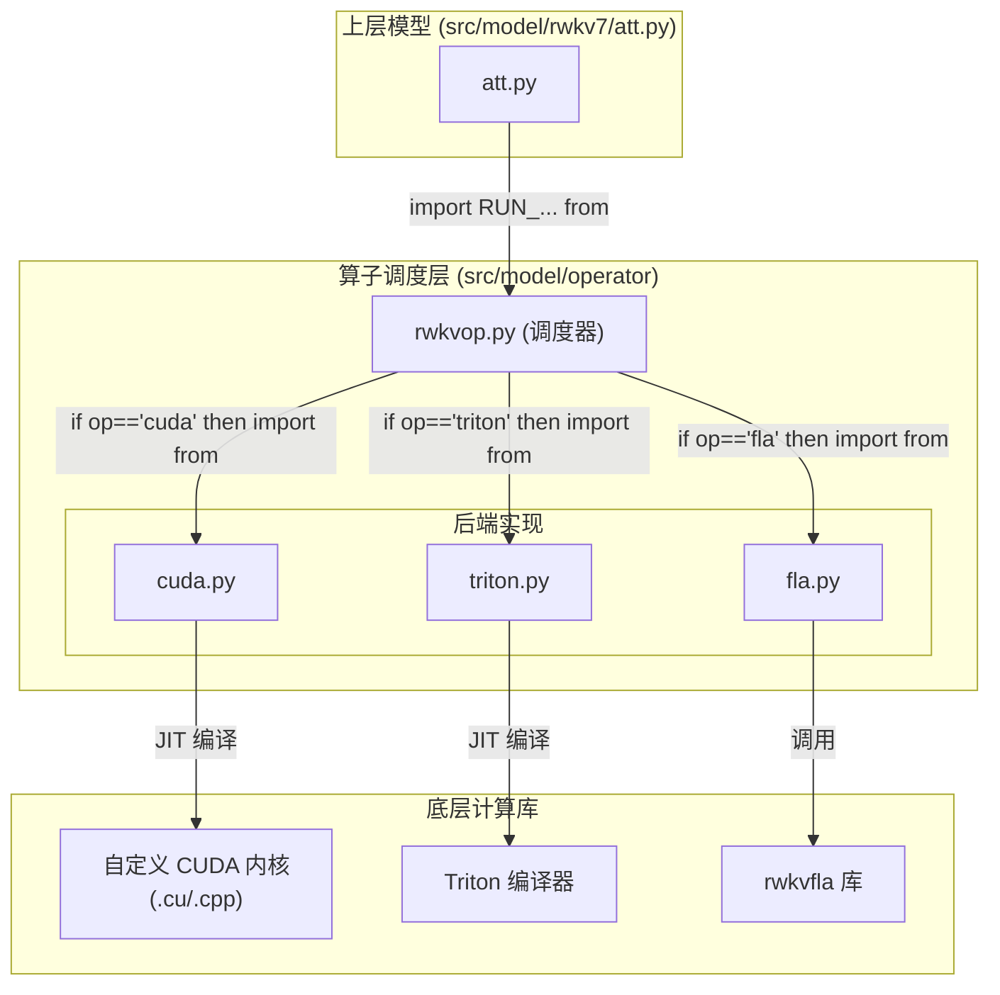

# 模块总结: `src/model/operator`

## 1. 目录功能定位

`src/model/operator` 目录是项目的**底层计算算子抽象与调度层**。

它的核心职责是为上层模型（特别是 `att.py` 中的 Time-mix 模块）提供一个统一的、与具体后端实现解耦的计算接口。通过一个中心调度文件（`rwkvop.py`），该目录可以根据全局配置动态地选择使用不同的高性能计算后端来执行核心的 WKV 运算。

这种设计极大地增强了项目的灵活性和可扩展性，使得研究人员可以轻松地在不同的硬件加速方案（如手写的 CUDA、Triton 或 FlashAttention 派生库）之间切换，以进行性能比较或利用特定平台的优势，而无需修改上层的模型逻辑。

---

## 2. 模块职责与交互关系

### 文件职责

- **`rwkvop.py`**:
  - **职责**: **核心算子调度器 (Dispatcher)**。这是该目录的唯一入口。它不包含任何计算逻辑，仅通过 `if/elif/else` 语句检查全局配置 `model_config.op` 的值 (`cuda`, `triton`, `fla`)，并从相应的后端文件中导入 `RUN_CUDA_RWKV7g`、`RUN_RWKV7_STATE` 和 `RUN_RWKV7_INFCTX` 这三个核心算子函数。
  - **定位**: 动态计算后端的路由器。

- **`cuda.py`**:
  - **职责**: **自定义 CUDA C++ 后端实现**。当 `model_config.op == 'cuda'` 时被调用。它使用 `torch.utils.cpp_extension.load` 在运行时即时编译（JIT）位于 `src/model/cuda/` 下的 `.cu` 和 `.cpp` 源码。其核心是 `WindBackstepping` 这个 `torch.autograd.Function`，它将自定义的 CUDA 前向和后向内核封装起来，使其能够无缝集成到 PyTorch 的自动微分图中。
  - **定位**: 默认的、基于手写 CUDA 内核的高性能后端。

- **`triton.py`**:
  - **职责**: **Triton 后端实现**。当 `model_config.op == 'triton'` 时被调用。它使用 Triton 语言（`@triton.jit`）直接在 Python 中编写高性能的 GPU 核函数 (`fw_attn_triton`, `bw_attn_triton`)。这些核函数同样被一个自定义的 `autograd.Function` (`TritonRWKV7`) 封装，以支持自动微分。
  - **定位**: 基于 Triton 的备选高性能后端，通常更易于编写和调试。

- **`fla.py`**:
  - **职责**: **FlashAttention-based 后端实现**。当 `model_config.op == 'fla'` 时被调用。它依赖一个外部的、专门为 RWKV 优化的 FlashAttention 库 (`rwkvfla`)，并调用其 `chunk_rwkv7` 函数来执行计算。该文件还根据训练类型（`infctx`, `state`）来决定具体包装哪个算子接口。
  - **定位**: 基于成熟的 FlashAttention 思想的备选高性能后端。

### 交互关系图 (Mermaid)

---

## 3. 模块依赖方向

- **`rwkvop.py`** 依赖于 `cuda.py`, `triton.py`, `fla.py`。
- **`cuda.py`** 依赖于 `src/model/cuda` 目录下的 C++/CUDA 源代码。
- **`triton.py`** 依赖 `triton` 库。
- **`fla.py`** 依赖 `rwkvfla` 库。
- 整个目录被上层模型（`src/model/rwkv7/att.py`）所依赖。

---

## 4. 暴露的公共接口

此目录的唯一公共接口是由 `rwkvop.py` **重新导出**的三个函数，它们的具体实现取决于配置：

- **`RUN_CUDA_RWKV7g(*args, **kwargs)`**:
  - **功能**: 执行常规的 WKV 注意力计算。

- **`RUN_RWKV7_STATE(*args, **kwargs)`**:
  - **功能**: 执行适用于"状态微调"模式的 WKV 计算（通常涉及状态传递）。

- **`RUN_RWKV7_INFCTX(*args, **kwargs)`**:
  - **功能**: 执行适用于"无限上下文"模式的 WKV 计算（同样涉及状态传递）。 