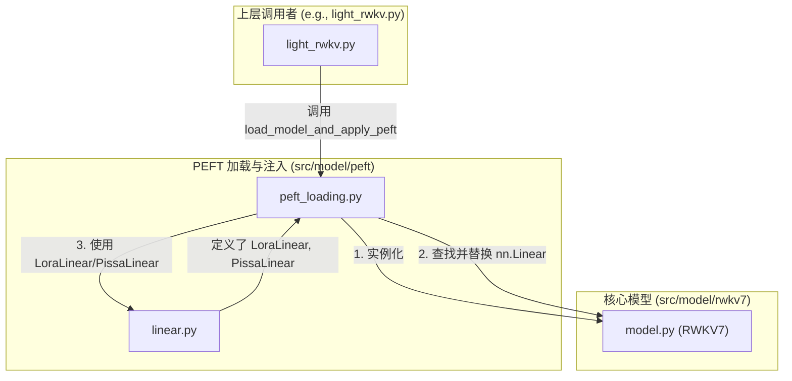

# 模块总结: `src/model/peft`

## 1. 目录功能定位

`src/model/peft` 目录是项目的**参数高效微调（PEFT）核心实现层**。

它的主要职责是提供将 PEFT 策略（如 LoRA、PiSSA）应用于 RWKV 基础模型的底层机制。这包括两个核心功能：
1.  **加载与注入**：在模型构建阶段，根据配置读取预训练的基础模型，并精准地将 PEFT 相关的可训练模块（如 LoRA 适配器）注入到指定的目标层（通常是 `att` 和 `ffn` 模块中的线性层）。
2.  **模块替换**：提供支持 PEFT 的自定义 `nn.Module`，特别是 `nn.Linear` 的替代品，这些替代品内置了对低秩矩阵、量化等技术的支持。

通过该目录的抽象，项目实现了微调逻辑与基础模型架构的解耦，使得在不修改核心模型代码的情况下，可以灵活地应用和切换不同的 PEFT 方法。

---

## 2. 模块职责与交互关系

### 文件职责

- **`peft_loading.py`**:
  - **职责**: **PEFT 模型加载与参数配置总调度器**。这是该目录最核心的模块，负责整个 PEFT 流程的编排。
  - **关键功能**:
    - `load_model_and_apply_peft()`: 这是该模块对外暴露的核心接口。它执行以下操作：
      1.  调用 `src.model.rwkv7.model.RWKV7` 加载基础模型结构。
      2.  根据 `config.peft.peft_load_path` 加载基础模型权重。
      3.  **参数冻结**: 遍历模型所有参数，默认将其 `requires_grad` 设置为 `False`。
      4.  **模块注入**: 检查 `config.peft.peft_name`，如果为 `lora` 或 `pissa`，则调用内部的 `_apply_lora_to_model` 或 `_apply_pissa_to_model` 函数。
      5.  **目标层定位**: 在注入函数内部，根据 `config.peft.lora_target_modules`（如 `["att.receptance", "att.key", "ffn.key", ...]`）精确找到需要被替换的线性层。
      6.  **可训练参数解冻**: 将注入的 PEFT 模块（如 `LoraLinear`）的参数和模型中明确指定解冻的其他参数（如 `emb` 或 `head`）的 `requires_grad` 重新设置为 `True`。
    - `_apply_lora_to_model()` / `_apply_pissa_to_model()`: 私有辅助函数，负责将 `nn.Linear` 替换为自定义的 `LoraLinear` 或 `PissaLinear`。

- **`linear.py`**:
  - **职责**: **提供支持 PEFT 的自定义线性层实现**。
  - **关键类**:
    - `LoraLinear(nn.Linear)`: 继承自 `nn.Linear`，并额外添加了 `lora_A` (`r x in_features`) 和 `lora_B` (`out_features x r`) 两个低秩矩阵作为其成员。它的 `forward` 方法实现了核心的 LoRA 逻辑：`output = F.linear(x, self.weight, self.bias) + self.lora_scaling * (self.lora_B @ self.lora_A @ x.transpose(-1,-2)).transpose(-1,-2)`。
    - `PissaLinear(LoraLinear)`: 继承自 `LoraLinear`，专门为 PiSSA 实现。PiSSA 的核心思想是重新参数化权重，该类在初始化时通过 `svd` 分解冻结的原始权重 `W`，并将其加到可训练的 `lora_A` 和 `lora_B` 上，从而实现更高效的微调。
  - **工具函数**:
    - `mark_only_lora_as_trainable()`: 一个辅助函数，用于在模型中再次确认只有 LoRA 相关的参数是可训练的。
    - `print_model_param()`: 打印模型中可训练参数和总参数数量的工具。
    - `NF4Linear` / `dequantize_nf4`: 提供了对 4-bit NormalFloat 量化的支持，用于在加载模型时减少内存占用。

### 交互关系图 (Mermaid)

---

## 3. 模块依赖方向

- **`peft_loading.py`** 是核心的协调者，它依赖于 `src.model.rwkv7.model` 来创建基础模型，并依赖于本目录下的 `linear.py` 来获取自定义的 PEFT 线性层。
- **`linear.py`** 相对独立，主要定义了 `nn.Module` 的子类，除了 `torch` 几乎没有外部依赖。
- 整个目录被上层模块（如 `src.model.light_rwkv` 或 `src.bin.train`）调用，用于在训练开始前完成模型的初始化和 PEFT 配置。

---

## 4. 暴露的公共接口

- **`peft_loading.py`**:
  - `load_model_and_apply_peft(config: ModelConfig, lora_config: LoraConfig) -> nn.Module`:
    - **功能**: 加载基础模型，根据配置应用 PEFT（LoRA 或 PiSSA），并返回一个准备好进行训练的、已配置好可训练参数的模型实例。

- **`linear.py`**:
  - `LoraLinear`, `PissaLinear`, `NF4Linear`:
    - **功能**: 自定义的 `nn.Module` 类，主要由 `peft_loading.py` 内部使用，但也可被其他模块导入用于构建更复杂的 PEFT 结构。
  - `mark_only_lora_as_trainable(...)`, `print_model_param(...)`:
    - **功能**: 可供外部调用的工具函数，用于验证和调试模型的可训练参数状态。 