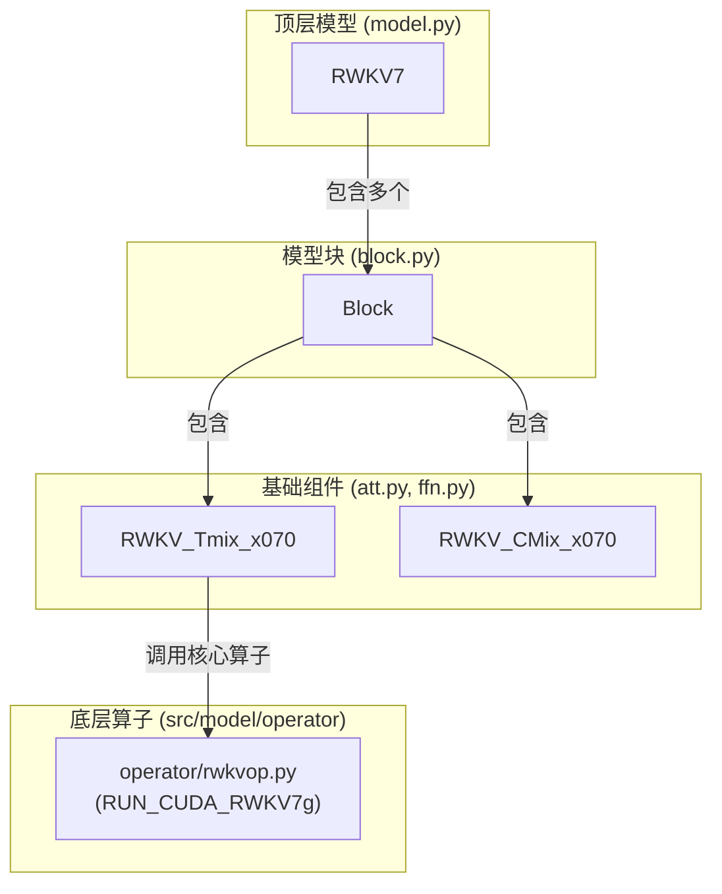

# 模块总结: `src/model/rwkv7`

## 1. 目录功能定位

`src/model/rwkv7` 目录是项目的**核心模型架构定义层**。

该目录的职责是利用基础的 PyTorch `nn.Module`，自底向上地构建出完整的 RWKV-v7 模型。它严格遵循 RWKV 的原始架构，将模型分解为最基本的组件（Time-mix 和 Channel-mix），然后将它们组装成一个标准的块（Block），最终通过堆叠这些块来形成完整的深度神经网络。

此目录中的所有模块都是纯粹的、无状态的计算图定义，不包含任何训练循环、优化器或 PEFT 相关的逻辑。这种清晰的职责分离确保了模型定义的核心稳定性和可复用性。

---

## 2. 模块职责与交互关系

### 文件职责 (自底向上)

- **`att.py` (Time-mix / WKV Attention)**:
  - **职责**: 实现 RWKV 模型的核心创新——**Time-mix 模块**，也即 WKV 注意力机制。
  - **关键类**: `RWKV_Tmix_x070`。
  - **核心逻辑**:
    1.  初始化时间衰减参数 (`time_decay`)、插值参数 (`time_faaaa`) 和一系列用于生成 R, K, V, G 的线性层。
    2.  `forward` 方法中，接收输入 `x` 和 `block_state`。
    3.  调用 `src.model.operator` 中的 `RUN_CUDA_RWKV7g` 函数执行高性能的 WKV 计算。这是模型计算与底层硬件加速算子唯一的交互点。
    4.  返回经过 Time-mix 处理后的输出和更新后的 `block_state`。

- **`ffn.py` (Channel-mix)**:
  - **职责**: 实现 RWKV 模型的另一个关键组件——**Channel-mix 模块**，功能上等价于传统 Transformer 中的前馈神经网络（FFN）。
  - **关键类**: `RWKV_CMix_x070`。
  - **核心逻辑**:
    1.  初始化用于混合通道信息的线性层。
    2.  `forward` 方法中，对输入 `x` 和 `block_state` 进行插值，然后通过两层线性变换和一个 `Mish` 激活函数，实现通道间的信息交互。
    3.  返回处理后的输出和更新后的 `block_state`。

- **`block.py`**:
  - **职责**: **将 Time-mix 和 Channel-mix 组合成一个完整的 RWKV 块**。
  - **关键类**: `Block`。
  - **核心逻辑**:
    1.  在 `__init__` 中实例化 `RWKV_Tmix_x070` 和 `RWKV_CMix_x070`。
    2.  `forward` 方法严格遵循 RWKV 的计算流程：输入 `x` 首先经过 `att` 模块（Time-mix），其输出再经过 `ffn` 模块（Channel-mix）。每个模块都会接收并更新相应的 `block_state`。

- **`model.py`**:
  - **职责**: **构建最终的、完整的 RWKV7 模型**。
  - **关键类**: `RWKV7`。
  - **核心逻辑**:
    1.  初始化词嵌入层 (`emb`)、多个 `Block` 实例、最终的 `LayerNorm` 层和输出头 (`head`)。
    2.  `forward` 方法定义了完整的模型前向传播路径：
        a. 输入 `idx` 通过 `emb` 转换为词向量。
        b. 词向量依次通过堆叠的 `Block`。`BlockStateList` 在此过程中负责高效地传递每一层的循环状态。
        c. 经过所有块之后，输出通过 `ln_out` 和 `head` 得到最终的 logits。
    3.  该类是整个项目的基础模型单元，被 `peft_loading.py` 和 `light_rwkv.py` 等上层模块直接实例化和使用。

### 交互关系图 (Mermaid)

---

## 3. 模块依赖方向

- **`model.py`** 依赖于 `block.py` 来构建模型层。
- **`block.py`** 依赖于 `att.py` 和 `ffn.py` 来构建块。
- **`att.py`** 依赖于 `src.model.operator` 来执行实际的数值计算。
- **`ffn.py`** 几乎是自包含的，仅依赖 `torch`。
- 整个目录被上层逻辑（如 `peft_loading.py`, `light_rwkv.py`）所依赖，作为模型实例化的入口。

---

## 4. 暴露的公共接口

- **`model.py`**:
  - `RWKV7(config: ModelConfig) -> nn.Module`:
    - **功能**: RWKV-v7 模型的构造器。返回一个完整的、可用的、但尚未加载权重的模型实例。这是整个目录最核心的对外接口。

- **`block.py`**:
  - `Block(config: ModelConfig, layer_id: int) -> nn.Module`:
    - **功能**: 单个 RWKV 块的构造器。通常由 `RWKV7` 内部使用。

- **`att.py` / `ffn.py`**:
  - `RWKV_Tmix_x070(...)`, `RWKV_CMix_x070(...)`:
    - **功能**: 模型基础组件的构造器。通常由 `Block` 内部使用。 