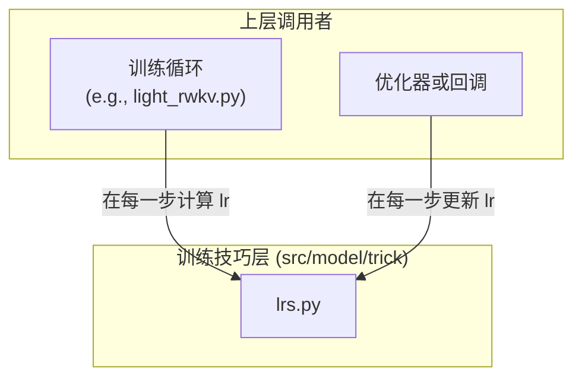

# 模块总结: `src/model/trick`

## 1. 目录功能定位

`src/model/trick` 目录是项目的**独立训练技巧（Training Tricks）实现层**。

它的核心职责是封装与模型架构本身无关、但能显著影响训练动态和最终性能的算法或策略。这些模块通常是纯函数的、可独立复用的工具，专注于解决训练过程中的特定问题，例如学习率调度。

将这些"技巧"放在一个独立的目录中，有助于保持核心模型定义的纯粹性，同时也使得这些工具能够被项目中的不同部分（如 `pl.LightningModule` 或自定义的优化器回调）按需、灵活地调用。

---

## 2. 模块职责与交互关系

### 文件职责

- **`lrs.py` (Learning Rate Schedulers)**:
  - **职责**: **提供与框架无关的学习率调度函数**。该文件包含了两种常用的学习率衰减策略的纯 Python 实现。
  - **关键功能**:
    - `cos_decay()`: 实现了一个标准的余弦衰减（Cosine Annealing）调度器。它根据当前步数、总步数、初始学习率和最终学习率，计算出当前步骤应有的学习率。
    - `wsd()`: 实现了带线性预热（Warmup）的余弦衰减调度器。在训练的初始阶段（`warmup_steps`），学习率从 0 线性增加到 `initial_lr`；之后，再按照余弦曲线从 `initial_lr` 衰减到 `final_lr`。
  - **定位**: 这是一个自包含的数学工具模块，不依赖任何 PyTorch 或 PyTorch Lightning 的组件，具有极高的可移植性。

### 交互关系图 (Mermaid)

*关系说明：上层的训练逻辑（如 PyTorch Lightning 的 `LightningModule` 或手动编写的训练循环）会在每个训练步骤（`on_train_batch_start` 或类似位置）调用 `lrs.py` 中的函数来计算当前应有的学习率，然后手动更新优化器中的参数组（`optimizer.param_groups`）。*

---

## 3. 模块依赖方向

- **`lrs.py`** 是一个独立的叶子模块（leaf module），它**不依赖项目中的任何其他模块**。
- 它仅依赖于 Python 的标准库 `math`。
- 上层的训练逻辑（例如 `src.model.light_rwkv.py` 中的 `configure_optimizers` 或 `optimizer_step` 方法）会依赖此模块来获取学习率。

---

## 4. 暴露的公共接口

- **`lrs.py`**:
  - `cos_decay(initial_lr, final_lr, current_step, total_steps) -> float`:
    - **功能**: 计算无预热的余弦衰减学习率。
  - `wsd(initial_lr, final_lr, current_step, total_steps, warmup_steps=100) -> float`:
    - **功能**: 计算带线性预热的余弦衰减学习率。 