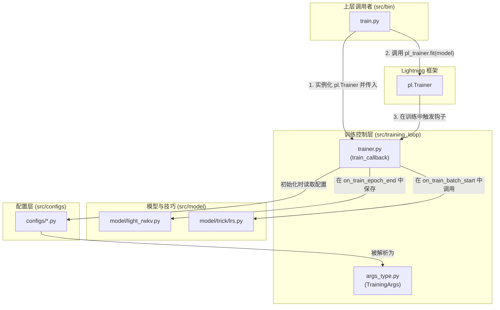

# 模块总结: `src/training_loop`

## 1. 目录功能定位

`src/training_loop` 目录是项目的**训练过程控制与回调（Callback）层**。

它的核心职责不是定义模型或训练步骤本身（这些由 `src/model` 目录完成），而是通过 PyTorch Lightning 的回调（Callback）机制，为训练过程注入动态的、有状态的行为。这包括在训练生命周期的特定时间点（如每个批次开始/结束，每个周期结束）执行的操作。

具体来说，该目录负责：
-   **动态参数调度**: 如学习率和权重衰减的实时计算与更新。
-   **监控与日志**: 记录损失、性能指标（如 tokens/sec），并将其输出到控制台、文件以及 `wandb` 等外部监控工具。
-   **模型检查点（Checkpointing）**: 根据策略（如周期数）智能地保存模型权重，并能区分处理基础模型和 PEFT 参数。

通过将这些关注点从核心的模型定义中分离出来，该目录实现了训练控制逻辑与模型计算逻辑的解耦，提高了代码的可维护性和复用性。

---

## 2. 模块职责与交互关系

### 文件职责

- **`args_type.py`**:
  - **职责**: **训练配置参数定义**。
  - **核心功能**: 定义了一个 `TrainingArgs` 的 `dataclass`，该类聚合了所有与训练相关的超参数（从数据路径到优化器设置，再到 PEFT 配置）。它作为项目配置的"模式"（Schema），确保了从 `.toml` 文件加载的配置是类型安全的，并提供了默认值。
  - **定位**: 静态的、类型化的配置容器。

- **`trainer.py`**:
  - **职责**: **核心训练回调与辅助工具**。
  - **关键类与函数**:
    - `train_callback(pl.Callback)`: 这是该目录的**核心**。作为一个 Lightning 回调，它实现了多个钩子函数：
      - `on_train_batch_start()`: 在每个批次开始前，调用 `src.model.trick.lrs` 中的调度函数计算当前的学习率，并更新优化器。
      - `on_train_batch_end()`: 在每个批次结束后，收集损失值，计算吞吐量，并将这些指标通过 `wandb`、`train_log.txt` 和 `loss_data.json`（用于前端可视化）记录下来。
      - `on_train_epoch_end()`: 在每个周期结束后，根据保存策略（`epoch_save`）决定是否保存模型。它包含复杂的逻辑来仅提取需要保存的权重（如只保存 PEFT 相关的参数），然后调用 `my_save` 函数执行保存。
    - `my_save(...)`: 一个封装了 `torch.save` 的辅助函数，提供了将模型权重保存到本地或 AWS S3 的统一接口。
    - `generate_init_weight(...)`: 一个一次性工具函数，用于在没有提供预训练权重时，生成一个随机初始化的权重文件，确保训练可以开始。

### 交互关系图 (Mermaid)

*关系说明：`bin/train.py` 首先将 `train_callback` 实例化并传递给 `pl.Trainer`。当 `pl.Trainer` 开始训练 `light_rwkv` 模型时，它会在训练循环的各个阶段自动调用 `train_callback` 中定义的钩子函数。`train_callback` 内部会使用 `lrs.py` 来计算学习率，并在需要时保存 `light_rwkv` 的状态。所有行为都由 `TrainingArgs` (其值来自 `configs` 模块) 来配置。*

---

## 3. 模块依赖方向

- **`trainer.py`** 依赖于 `pytorch_lightning` 框架、`src.model.trick.lrs`（用于LR调度）以及 `src.configs`（用于获取配置）。它作用于 `pl.LightningModule` 的实例（即 `light_rwkv`）。
- **`args_type.py`** 是一个独立的定义文件，不依赖于项目中的其他模块。
- 整个目录被上层的 `src/bin/train.py` 所依赖，用于构建和配置 `pl.Trainer`。

---

## 4. 暴露的公共接口

- **`trainer.py`**:
  - `train_callback(args) -> pl.Callback`:
    - **功能**: 构造器，返回一个配置好的、可供 `pl.Trainer` 使用的回调实例。
  - `generate_init_weight(model, init_weight_name)`:
    - **功能**: 一个独立的工具函数，用于生成初始权重文件。

- **`args_type.py`**:
  - `TrainingArgs`:
    - **功能**: `dataclass`，作为类型注解和配置容器被项目中的多个模块导入。 