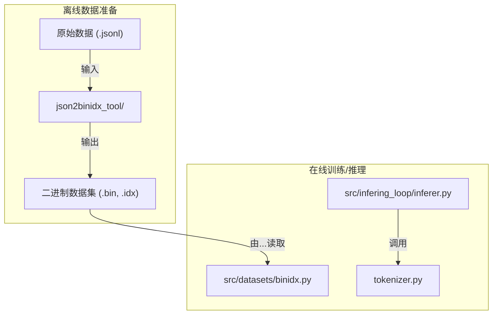

# 模块总结: `src/utils`

## 1. 目录功能定位

`src/utils` 目录是项目的**通用工具与数据预处理层**。

该目录包含了两种不同性质的工具：
1.  **在线工具 (`tokenizer.py`)**: 在程序运行时被导入和调用的模块，提供文本处理和采样等核心功能，主要服务于模型的推理和交互过程。
2.  **离线工具 (`json2binidx_tool/`)**: 一个独立的、自包含的命令行脚本集合，用于在训练开始之前，将原始的文本数据集（`.jsonl` 格式）预处理成项目所需的高效二进制格式（`.bin`/`.idx`）。

通过这种划分，该目录将"运行时依赖的工具"与"一次性数据准备脚本"清晰地分离开来，使得项目的主体逻辑（如训练和推理）可以依赖一个轻量级的 `tokenizer.py`，而将繁重的数据转换工作交给专用的离线脚本处理。

---

## 2. 模块职责与交互关系

### 文件/子目录职责

- **`tokenizer.py`**:
  - **职责**: **提供运行时的文本分词与 logits 采样功能**。
  - **关键类与功能**:
    - `Tokenizer` 类: 这是一个核心的封装类，提供了统一的接口来处理文本。
      - **双模式支持**: 能够根据配置加载标准的 Hugging Face `transformers` 分词器，或一个自定义的字符级分词器。
      - `refine_context()`: 提供文本清理功能。
      - `sample_logits()`: 实现带 `temperature` 和 `top_p` 的采样逻辑，是模型生成下一个 token 的关键。该方法还能根据上下文（如最后一个 token 是否为换行符）动态调整 `top_p` 值，并能自动在 CPU (NumPy) 和 GPU (PyTorch) 实现之间切换。
    - **其他工具**: 文件还包含一些与分词无关的辅助函数，如素数检测和简单的性能计时器。
  - **定位**: 服务于推理和生成的核心运行时工具。

- **`json2binidx_tool/`**:
  - **职责**: **将 `.jsonl` 数据集转换为二进制格式**。
  - **核心功能**: 这是一个独立的命令行工具，其入口点是 `tools/preprocess_data.py`。用户通过命令行调用此脚本，可以：
    1.  读取一个包含多篇文档的 `.jsonl` 文件。
    2.  使用指定的词表（Hugging Face 或 RWKV 自定义词表）对每篇文档进行分词。
    3.  将所有分词后的 token 序列拼接起来，并保存为一个大型的二进制文件 (`.bin`)。
    4.  同时创建一个索引文件 (`.idx`)，用于记录每篇文档在 `.bin` 文件中的起始位置和长度。
  - **定位**: 训练开始前的一次性、离线数据预处理管道。它的**输出**被 `src/datasets/binidx.py` 所**消费**。

### 交互关系图 (Mermaid)

*关系说明：`json2binidx_tool` 是一个独立的预处理步骤。它的输出 `.bin`/`.idx` 文件是训练流程的输入，由 `src/datasets` 模块负责加载。而 `tokenizer.py` 则在运行时被需要进行文本生成和采样的模块（如 `inferer.py`）直接调用。*

---

## 3. 模块依赖方向

- **`tokenizer.py`** 依赖 `torch` 和 `transformers`。它被项目中的其他模块（如 `infering_loop`）作为库导入。
- **`json2binidx_tool/`** 是自包含的。它有自己的 `requirements.txt`，并且不被项目中的任何其他模块导入。它是一个独立的工具。

---

## 4. 暴露的公共接口

- **`tokenizer.py`**:
  - `Tokenizer(WORD_NAME, ...)`:
    - **功能**: 构造器，返回一个配置好的分词器和采样器实例。

- **`json2binidx_tool/`**:
  - **无程序化接口**。这是一个命令行工具，其接口是通过 `python tools/preprocess_data.py` 及其命令行参数定义的。 